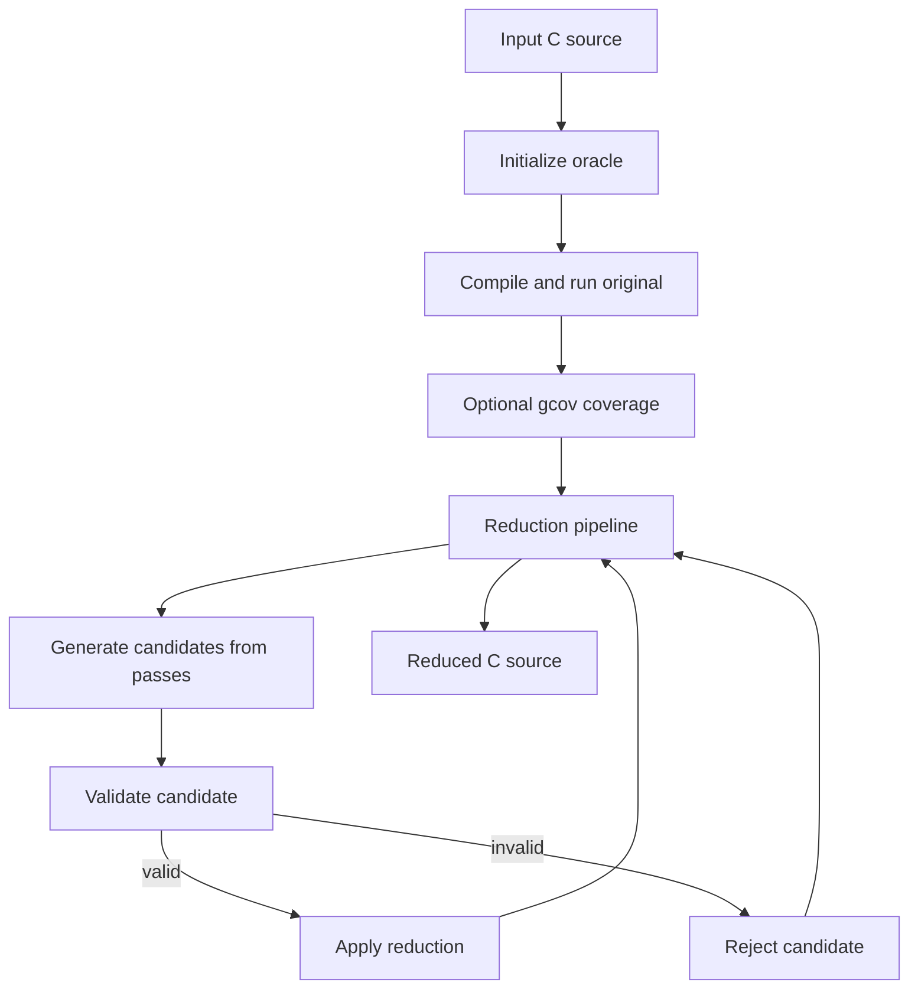
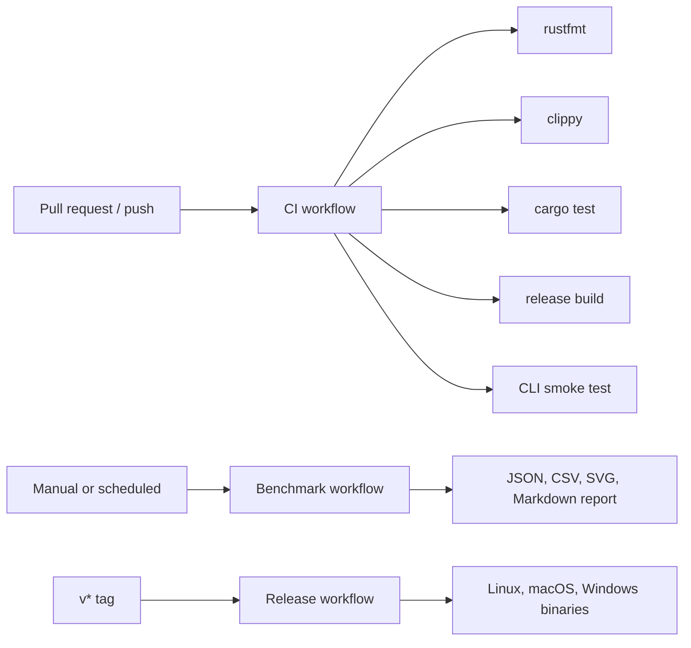

# C Program Slicer

[](https://github.com/v1bh475u/c-reducer/actions/workflows/ci.yml)
[](https://github.com/v1bh475u/c-reducer/actions/workflows/benchmark.yml)
[](https://github.com/v1bh475u/c-reducer/actions/workflows/release.yml)

A C program reducer written in Rust. It minimizes C source code while preserving specified behavior, including compilation, output, and optionally code coverage and CPU-cycle characteristics.

For a high-level overview and explanation of the tool, read the blog post: [Made a Sourcecode Reducer](https://vibhatsu.me/posts/made-a-sourcecode-reducer/).

## Features

- **libclang-based parsing**: Handles functions, declarations, statements, typedefs, structs, enums, and includes.
- **clangd diagnostics**: Uses clangd LSP diagnostics for unused variables, unused parameters, and unused includes.
- **Ten reduction passes**: Dead function/code removal, unused variable/parameter/global/struct-field removal, statement merging, typedef removal, enum/struct removal, and header removal.
- **Validation oracle**: Parses, compiles, runs, compares output, and optionally compares coverage before accepting a reduction.
- **Coverage-aware reduction**: Uses gcov data to preserve originally executed lines.
- **Cycle measurement support**: Uses Linux `perf` where available to measure CPU cycles.
- **Time-bounded runs**: Supports a total timeout for CI and automated workflows.

## How It Works



The reducer repeatedly asks each pass for candidate source edits. A candidate is only kept when the validation oracle confirms that the modified program still preserves the original behavior.

## Prerequisites

- Rust stable, via `rustup`
- LLVM/Clang with libclang development files
- `clangd`
- GCC
- `gcov` for coverage validation
- Linux `perf` for cycle measurement and benchmark cycle data
- Python 3.10+ for benchmark/report scripts

```bash
# Ubuntu/Debian
sudo apt-get update
sudo apt-get install -y llvm-dev libclang-dev clang clangd gcc gcovr linux-tools-common linux-tools-generic

# macOS
brew install llvm

# Windows
choco install llvm -y
```

## Installation

```bash
cargo build --release
```

The binary is written to `target/release/slicer` on Unix-like systems and `target/release/slicer.exe` on Windows.

## Quick Start

```bash
# Basic reduction
slicer -i program.c

# With explicit output path
slicer -i program.c -o reduced.c

# With more iterations and a longer per-execution timeout
slicer -i program.c --iterations 200 --timeout 10

# Without coverage checking
slicer -i program.c --no-coverage

# With a total wall-clock timeout for CI
slicer -i program.c --no-coverage --total-timeout 60

# With extra compiler flags
slicer -i program.c -f "-O2" -f "-std=c11"
```

Output defaults to `program.reduced.c` alongside the input file.

## CLI Options

| Option | Short | Default | Description |
|--------|-------|---------|-------------|
| `--input` | `-i` | required | Input C source file |
| `--output` | `-o` | `<input>.reduced.c` | Output file path |
| `--iterations` | | `100` | Maximum reduction iterations |
| `--timeout` | `-t` | `5` | Per-execution timeout in seconds |
| `--total-timeout` | | `0` | Total wall-clock timeout for the reduction; `0` disables it |
| `--no-coverage` | | `false` | Disable coverage-based validation |
| `--flag` | `-f` | none | Extra compiler flag; repeatable |

## Reduction Passes

| # | Pass | Purpose | Analysis Method |
|---|------|---------|-----------------|
| 1 | `DeadFunctionPass` | Removes uncalled functions | libclang parser |
| 2 | `DeadCodePass` | Removes unexecuted code | gcov coverage |
| 3 | `UnusedVariablePass` | Removes unused variables | clangd LSP |
| 4 | `ArgumentRemovalPass` | Removes unused function parameters and updates call sites | clangd LSP + parser |
| 5 | `GlobalRemovalPass` | Removes unreferenced globals | Identifier counting |
| 6 | `StructMemberRemovalPass` | Removes unaccessed struct fields | Access pattern search |
| 7 | `StatementMergePass` | Merges consecutive statements | libclang parser |
| 8 | `TypedefPass` | Removes typedef declarations | Text scan |
| 9 | `EnumStructRemovalPass` | Removes unused enum/struct declarations | Identifier counting |
| 10 | `HeaderRemovalPass` | Removes unused `#include` directives | clangd LSP |

## Project Structure

```text
crates/
|-- slicer-cli/         # CLI binary
|-- slicer-core/        # Core traits, candidates, context, and pipeline
|-- slicer-parser/      # libclang-based C parser
|-- slicer-passes/      # Reduction pass implementations
`-- slicer-validator/   # Oracle, compiler, executor, coverage, and cycle measurement
```

## Testing

```bash
# Unit and integration tests; single-threaded because libclang has global state
cargo test --workspace -- --test-threads=1

# Formatting and linting
cargo fmt --all -- --check
cargo clippy --workspace --all-targets -- -D warnings

# CSmith integration tests on Linux
bash tests/run_csmith_tests.sh 10 2
```

## CI/CD



The repository includes three GitHub Actions workflows:

- `ci.yml`: runs Rust formatting, Clippy, tests, release build, and a CLI smoke test.
- `benchmark.yml`: runs Linux fixture benchmarks, generates charts, writes a Markdown report, and uploads artifacts. It can optionally run the existing CSmith stress suite.
- `release.yml`: builds release binaries for Linux, macOS, and Windows when a `v*` tag is pushed, then uploads them to a GitHub Release.

## Benchmarking and Reports

Benchmarking is intentionally Linux-first because coverage and cycle tooling depend on GCC/gcov and `perf`. The Python scripts are standard-library only and can be inspected or run without installing extra Python packages.

```bash
# Build, run fixture benchmarks, and write JSON/CSV results
python3 scripts/benchmark.py \
  --fixtures tests/integration \
  --out docs/benchmarks/latest \
  --iterations 100 \
  --timeout 5 \
  --total-timeout 60 \
  --no-coverage

# Generate SVG charts from results.json
python3 scripts/plot_benchmarks.py docs/benchmarks/latest/results.json

# Generate a Markdown report
python3 scripts/summarize_benchmarks.py docs/benchmarks/latest/results.json
```

Generated files include:

- `docs/benchmarks/latest/results.json`
- `docs/benchmarks/latest/results.csv`
- `docs/benchmarks/latest/status.svg`
- `docs/benchmarks/latest/line-reduction.svg`
- `docs/benchmarks/latest/byte-reduction.svg`
- `docs/benchmarks/latest/runtime.svg`
- `docs/benchmarks/latest/report.md`

The benchmark JSON records machine details needed to interpret results, including OS, kernel, architecture, CPU model/count, memory, and tool versions. It deliberately avoids recording current working directories, home directories, temp directories, repository paths, and absolute benchmark input/output paths.

## Documentation

- [Architecture](docs/ARCHITECTURE.md): system design, data flow, and key components
- [API Reference](docs/API.md): public types, traits, and usage examples
- [Reduction Passes](docs/PASSES.md): detailed pass descriptions and implementation notes
- [Benchmark Notes](docs/benchmarks/README.md): generated benchmark artifact guidance

## License

MIT License. See [LICENSE](LICENSE).
